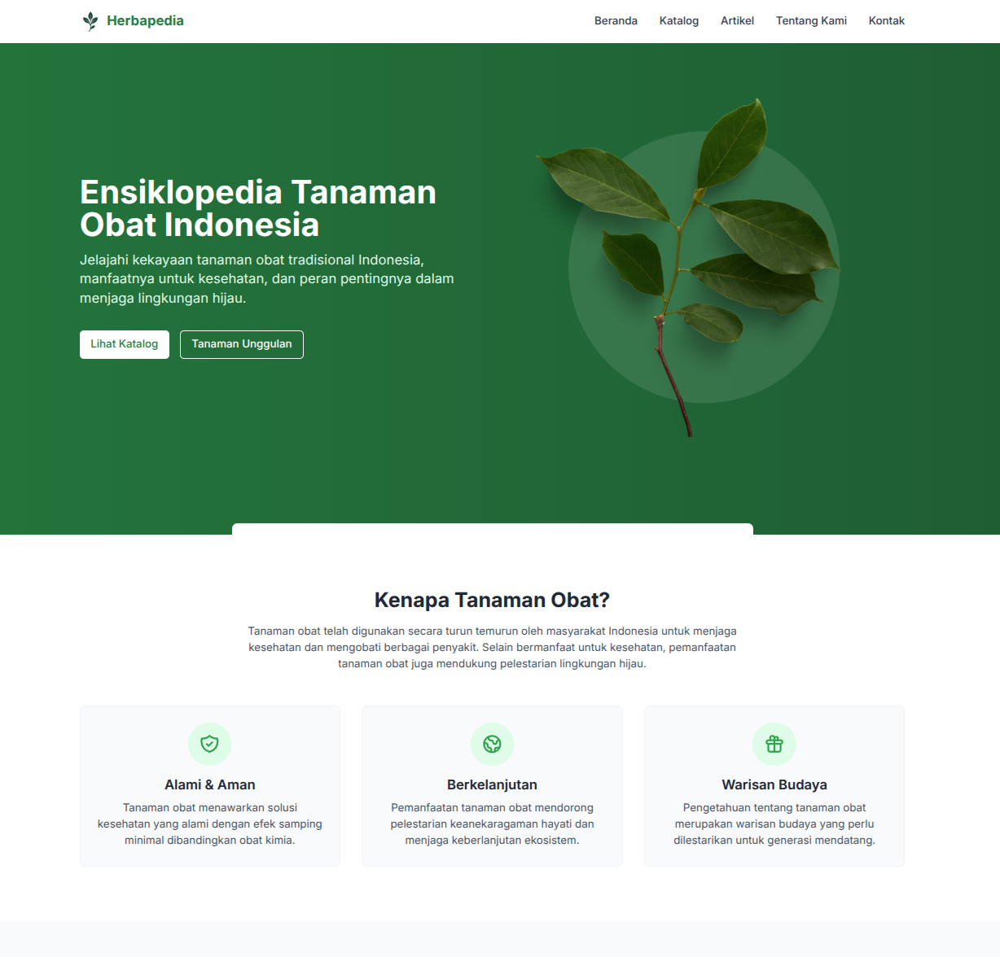
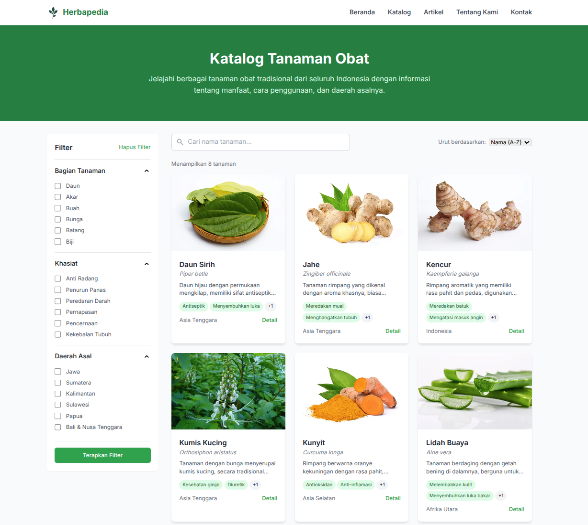
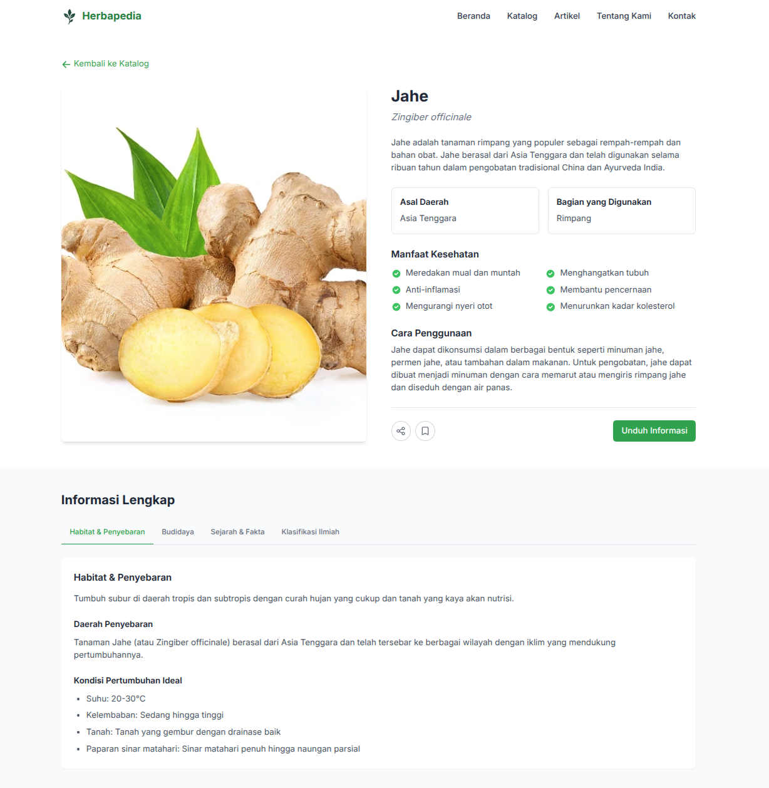

# 🌿 Herbapedia - Ensiklopedia Tanaman Obat Indonesia

<div align="center">
  
</div>

Herbapedia adalah platform digital komprehensif yang mendokumentasikan kekayaan tanaman obat tradisional Indonesia. Dibangun dengan teknologi modern, Herbapedia bertujuan untuk melestarikan pengetahuan lokal dan mendorong upaya pelestarian lingkungan hijau.

## ✨ Fitur Utama

- **📚 Katalog Tanaman Obat** - Lebih dari 100+ jenis tanaman obat tradisional dengan informasi lengkap
- **🔍 Pencarian & Filter** - Temukan tanaman berdasarkan nama, manfaat, atau asal daerah
- **📝 Artikel Edukasi** - Konten informatif tentang budidaya, manfaat, dan pelestarian
- **📱 Responsif** - Tampilan optimal di semua perangkat

## 🛠️ Teknologi

Herbapedia dibangun menggunakan stack teknologi modern:

- **Next.js** - Framework React yang memberikan pengalaman pengembangan yang luar biasa
- **React** - Library JavaScript untuk membangun antarmuka pengguna
- **TypeScript** - Superset JavaScript dengan typing statis
- **Tailwind CSS** - Framework CSS utility-first untuk desain yang cepat dan responsif
- **Node.js** - Runtime JavaScript untuk menjalankan aplikasi di server

## 🚀 Memulai

### Prasyarat

- Node.js (versi 14.0.0 atau lebih baru)
- npm (versi 6.0.0 atau lebih baru)

### Instalasi

1. Clone repositori ini
   ```bash
   git clone https://github.com/notsuperganang/herbapedia.git
   cd herbapedia
   ```

2. Install dependensi
   ```bash
   npm install
   ```

3. Jalankan server pengembangan
   ```bash
   npm run dev
   ```

4. Buka [http://localhost:3000](http://localhost:3000) di browser Anda

## 📂 Struktur Proyek

```
herbapedia/
├── public/           # Aset statis (gambar, ikon)
│   ├── articles/     # Gambar untuk artikel
│   └── plants/       # Gambar tanaman
├── src/              # Kode sumber
│   ├── app/          # Halaman aplikasi (Next.js App Router)
│   │   ├── artikel/  # Halaman artikel
│   │   ├── katalog/  # Halaman katalog tanaman
│   │   ├── kontak/   # Halaman kontak
│   │   ├── tanaman/  # Halaman detail tanaman
│   │   └── tentang/  # Halaman tentang kami
│   └── components/   # Komponen React yang dapat digunakan kembali
│       ├── articles/ # Komponen terkait artikel
│       ├── catalog/  # Komponen terkait katalog
│       ├── contact/  # Komponen terkait kontak
│       ├── home/     # Komponen halaman beranda
│       └── plants/   # Komponen terkait tanaman
└── ...               # File konfigurasi dan lainnya
```

## 🖼️ Screenshot





## 🌱 Kontribusi

Kami sangat menghargai kontribusi dari komunitas! Jika Anda tertarik untuk berkontribusi pada Herbapedia, silakan ikuti langkah-langkah berikut:

1. Fork repositori ini
2. Buat branch fitur baru (`git checkout -b feature/amazing-feature`)
3. Commit perubahan Anda (`git commit -m 'Add some amazing feature'`)
4. Push ke branch (`git push origin feature/amazing-feature`)
5. Buka Pull Request

## 📄 Lisensi

Proyek ini dilisensikan di bawah Lisensi MIT - lihat file [LICENSE](LICENSE) untuk detail.

## 👨‍💻 Tim Pengembang

<div align="center">
  
  <h3>Ganang Setyo Hadi</h3>
  <p><i>Pengembang</i></p>
  <p>Berperan penting dalam mengembangkan sistem Herbapedia untuk memudahkan masyarakat mengakses informasi tanaman obat.</p>
  
  
  <h3>Muhammad Khalid Al Ghifari</h3>
  <p><i>Pengembang</i></p>
  <p>Berfokus pada pengembangan antarmuka dan pengalaman pengguna dalam aplikasi Herbapedia.</p>
</div>

---

<p align="center">Dibuat dengan ❤️ untuk melestarikan warisan budaya Indonesia</p>

<p align="center">
  <a href="https://github.com/username/herbapedia/issues">Laporkan Bug</a> •
  <a href="https://github.com/username/herbapedia/issues">Request Fitur</a>
</p>